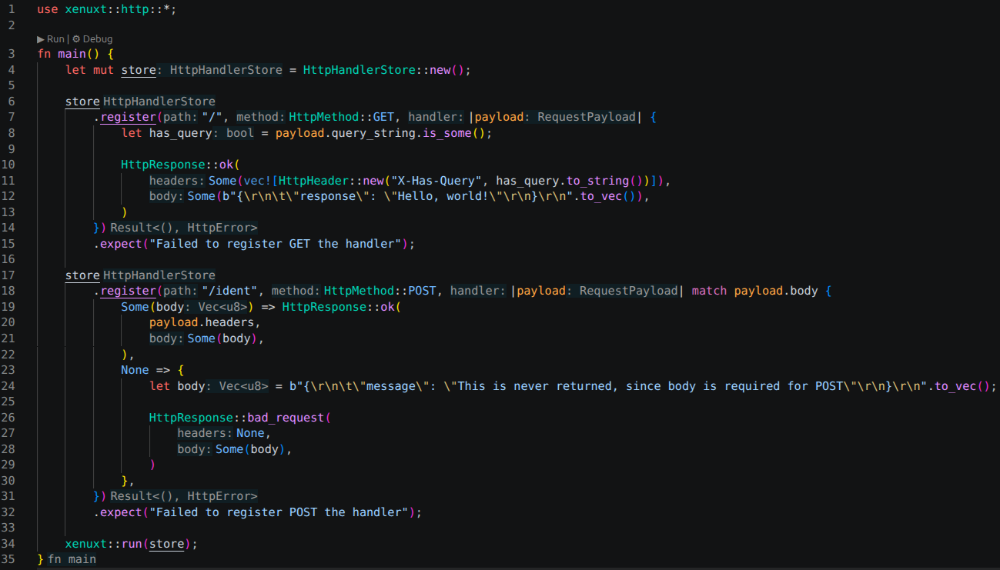
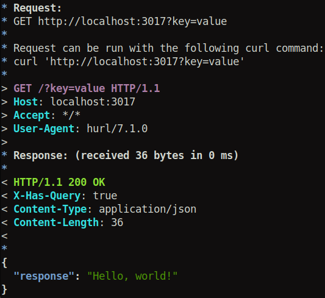
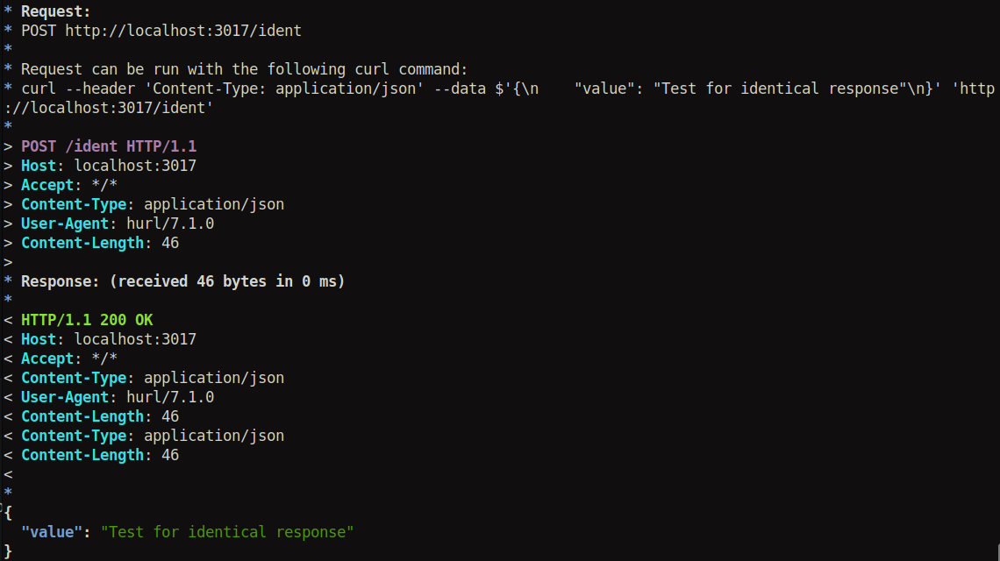

# Xenuxt

A primitive HTTP/1.1 server written in Rust for learning purposes.

It is based on [RFC 7230](https://datatracker.ietf.org/doc/html/rfc7230), but does **NOT** implement every detail of the specification. Instead, Xenuxt aims to provide a minimal, reasonable subset of HTTP/1.1 functionality while keeping the implementation simple and understandable.

## Disclaimer

**Xenuxt is a learning project and is NOT designed or recommended for production use.**  
**It intentionally implements only a limited subset of HTTP/1.1 and does **NOT** provide security, performance, reliability or completeness.**  
**Production use is strongly discouraged.**  

## Usage

**The following is an example of Xenuxt API usage from another project:**  

   

**Below is the result of making a request to the registered `GET` endpoint:**  

  

**And here is the result of making a request to the registered `POST` endpoint:**  

  